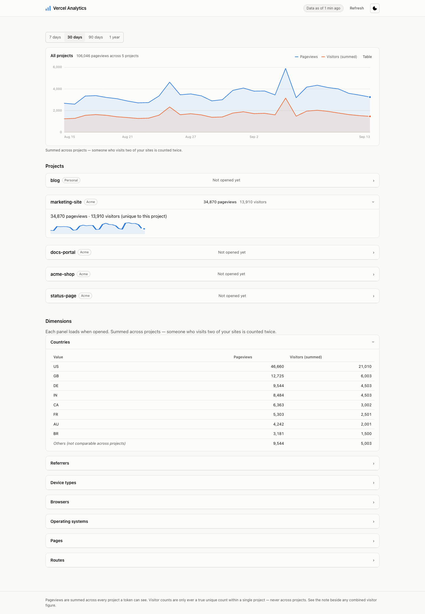

# vercel-analytics

One dashboard for [Vercel Web Analytics](https://vercel.com/docs/analytics)
across **every project, on every team, that a single Vercel token can see** —
with a combined total.

Vercel's own dashboard shows one project at a time, inside one team, and has
no cross-team view at all. If you run several sites across a personal account
and one or more teams, there is no single page that answers "how is
everything doing today?" — you have to click through each project
individually and add it up yourself. This tool queries Vercel's documented
REST API live, on every request, and does that adding-up for you.

There is no database, no polling, no cron job, no build step, and **zero
npm dependencies**. It is plain Node.js, start to finish.



*(Sample data — a fake token, a fake team, and five fake projects. See
[How it works](#how-it-works) for what's actually running underneath it.)*

## Quick start

1. Create a Vercel access token at
   [vercel.com/account/tokens](https://vercel.com/account/tokens). Read
   access is enough — this tool never writes anything to your Vercel account.
2. Run it:

   ```bash
   VERCEL_TOKEN=your-token-here npm start
   ```

   There is no install step. The project has no dependencies, so there is
   nothing for `npm install` to fetch.
3. Open the page the server prints (`http://127.0.0.1:4320` by default).

That's it — every analytics-enabled project the token can see, across your
personal scope and every team, on one page.

## Configuration

All configuration is environment variables. Only `VERCEL_TOKEN` is required.

| Variable | Default | Meaning |
|---|---|---|
| `VERCEL_TOKEN` | — | **Required.** A Vercel access token with read access. |
| `PORT` (or `VA_PORT`) | `4320` | Port to listen on. `PORT` takes precedence if both are set. |
| `VA_HOST` | `127.0.0.1` | Interface to bind to. Any value other than `127.0.0.1`, `::1`, `localhost` or unset — `0.0.0.0` included — counts as exposed beyond loopback, the same as running on Vercel or setting `VA_ALLOWED_HOSTS` (see [Deployment](#deployment)). |
| `VA_API_BASE_URL` | `https://api.vercel.com` | Override the Vercel API base URL. Mainly for tests. |
| `VA_PASSWORD` | — | Passphrase login. Required once the server is reachable beyond loopback (see [Deployment](#deployment)). Must be 20+ characters after trimming. |
| `VA_ALLOW_PUBLIC` | `0` | Deliberate override to run exposed beyond loopback with **no** passphrase. |
| `VA_ALLOWED_HOSTS` | — | Comma-separated `Host` header values to accept in addition to loopback names — the hostname(s) this deployment is actually served on. Required once exposed beyond loopback (see [Deployment](#deployment)). |
| `VA_SECURE_COOKIES` | on when exposed beyond loopback, off otherwise | Force the session cookie's `Secure` flag on or off. |
| `VA_CACHE_TTL_MS` | `300000` (5 minutes) | How long a fetched Vercel API response is reused before being re-fetched. |
| `VA_CONCURRENCY` | `5` | How many upstream Vercel API requests run at once. |
| `VA_TEAMS` | all teams | Comma-separated allowlist of team slugs. When set, only these teams (plus your personal scope) are queried. |

`VERCEL_TOKEN` keeps its conventional name because it's what the Vercel CLI
and other Vercel tooling already use. Everything this project invents is
`VA_`-prefixed.

## How it works

Every request runs this pipeline live, against Vercel's REST API, with
nothing persisted between requests:

1. **Discovery.** List every team the token can see (`GET /v2/teams`), then
   list every project in your personal scope and each team
   (`GET /v9/projects`, paginated), keeping only the ones with Web Analytics
   enabled.
2. **Per-project queries through a bounded pool.** Vercel's Web Analytics
   API has no cross-project endpoint, so getting a combined number means
   querying every project's own analytics separately — one
   `GET /v1/query/web-analytics/visits/aggregate` call per project. These
   run concurrently, capped at `VA_CONCURRENCY` (`src/pool.js`), so a
   fifty-project account doesn't fire fifty simultaneous requests at
   Vercel or wait for them one at a time.
3. **Pure aggregation.** The per-project results are merged by
   `src/aggregate.js` — plain arithmetic over the numbers Vercel already
   returned, no I/O, no further API calls. This is also where the
   visitors-sum rule below is enforced: it's the one place that decides
   what gets called `visitors` and what gets called `visitorsSum`.
4. **Two-stage loading.** Loading the page only ever makes two calls up
   front — projects, and the combined overview chart. Each project's own
   panel and each of the seven dimension breakdowns (country, referrer,
   device, browser, OS, path, route) fetches its own data the first time
   you open it, not before. A dashboard with a dozen projects would cost
   roughly one upstream call per project per dimension if every panel
   loaded eagerly — about 89 calls for a page this size — for numbers most
   visits never look at.

A fetched response is cached for `VA_CACHE_TTL_MS` (5 minutes by default),
so opening the same panel twice in a row doesn't re-query Vercel twice.

## The visitors rule — read this before you trust a combined number

**Pageviews sum across projects. Visitors do not, and the combined field
reflects that.**

Vercel deduplicates a "visitor" only *within the scope of a single query* —
one project, one time window. Every query this tool makes to Vercel's
Web Analytics API is scoped to exactly one project, because that is the only
scope the API supports. There is no endpoint, documented or otherwise, that
returns a deduplicated visitor count across multiple projects.

That means when this tool combines several projects' numbers into one total,
the visitor figure is a **sum of already-deduplicated per-project counts** —
not a fresh deduplication across all of them. Someone who visits two of your
sites in the same window is counted once for each site, so twice in the
total. There is no way to avoid this with the data the API provides; any tool
that claims a cross-project "unique visitors" number is either wrong or
guessing.

Because of this, the two figures are named differently and deliberately:

- A **single-project** view (`/api/projects/:id`, or the "Per project" band
  of the dashboard) reports a field called **`visitors`**. This is exactly
  Vercel's own number for that one project — genuinely deduplicated, because
  it never crosses a project boundary.
- Any **combined** view (`/api/overview`, `/api/dimension/:name`, the
  "Combined" band and the dimension tables) reports a field called
  **`visitorsSum`**, never `visitors`. It is a sum, and its name says so.

If you only care about one project's traffic, `visitors` is trustworthy as
Vercel reports it. If you're looking at a combined figure across projects,
treat it as an upper bound on how many people visited *something*, not a
count of distinct people.

## API

All four data routes return JSON and share two response conventions:

- `failures`: an array of `{ scope, message }` for any team or project that
  could not be reached. One failing project or team never empties the
  response for everything else — you get partial results plus a list of
  what didn't come back.
- `fetchedAt`: an ISO timestamp for the data's age. When a response mixes
  several cached upstream calls of different ages, this is the **oldest**
  of them, so it never reads more fresh than the stalest number it contains.

### `GET /api/health`

Liveness check. Returns `{ "ok": true }`. No auth beyond the host guard
below.

### `GET /api/projects`

Every analytics-enabled project the token can see, across your personal
scope and every team (or every team listed in `VA_TEAMS`, if set).

```json
{
  "projects": [
    { "id": "prj_example", "name": "acme-site", "team": "Acme", "teamSlug": "acme", "enabledAt": 1690000000000 }
  ],
  "failures": [],
  "fetchedAt": "2026-09-13T12:00:00.000Z"
}
```

### `GET /api/projects/:id?range=7|30|90|365`

One project's own daily series. `range` selects the window in days and
defaults to `30`. Because this is scoped to exactly one project, `visitors`
here is Vercel's own deduplicated figure for that project — see
[The visitors rule](#the-visitors-rule--read-this-before-you-trust-a-combined-number)
above. An id that doesn't resolve to an analytics-enabled project (unknown,
deleted, or analytics never enabled) is a `404`.

```json
{
  "project": { "id": "prj_example", "name": "acme-site", "team": "Acme", "teamSlug": "acme", "enabledAt": 1690000000000 },
  "days": ["2026-08-15", "..."],
  "pageviews": [120, 98, "..."],
  "visitors": [45, 39, "..."],
  "totals": { "pageviews": 4200, "visitors": 1500 },
  "failures": [],
  "fetchedAt": "2026-09-13T12:00:00.000Z"
}
```

### `GET /api/overview?range=7|30|90|365`

The combined daily series across every project. `range` defaults to `30`.

```json
{
  "days": ["2026-08-15", "..."],
  "pageviews": [820, 764, "..."],
  "visitorsSum": [310, 289, "..."],
  "totals": { "pageviews": 25000, "visitorsSum": 9200, "projects": 6 },
  "failures": [],
  "fetchedAt": "2026-09-13T12:00:00.000Z"
}
```

### `GET /api/dimension/:name?range=7|30|90|365&projectId=…`

A breakdown by one dimension, combined across projects (or scoped to one
project with `projectId`). `:name` must be one of the allowlisted
dimensions: `country`, `referrer_hostname`, `device_type`, `browser_name`,
`os_name`, `request_path`, `route`. Any other value is a `400`. A
`projectId` that doesn't resolve to an analytics-enabled project is a `404`,
the same as `GET /api/projects/:id` — an unknown project never comes back
as a silent, empty breakdown.

```json
{
  "dimension": "country",
  "rows": [
    { "value": "US", "pageviews": 9000, "visitorsSum": 3200, "others": false },
    { "value": "Others", "pageviews": 1200, "visitorsSum": 500, "others": true }
  ],
  "failures": [],
  "fetchedAt": "2026-09-13T12:00:00.000Z"
}
```

`Others` (Vercel's own long-tail bucket) is a different set of underlying
values per project, so it's not a comparable row with the rest — it's kept
for an honest total but always sorted last.

## Embedding

Two ways to use this outside its own dashboard:

- **Proxy the JSON API.** Point another frontend, or a server-side fetch, at
  the four routes above. They're plain JSON over HTTP with no
  framework-specific shape.
- **Import the aggregation core directly.** `src/vercel.js` (the Vercel API
  client) and `src/aggregate.js` (the merging logic, including the
  visitors-sum rule) are both plain ESM modules with no framework
  assumptions and no dependencies. `src/aggregate.js` in particular is pure
  and does no I/O at all — feed it the same `perProject` shape the API uses
  internally and it will merge it the same way, with no server required.

## Requirements

- **Node 20+** to run it.
- **Node 22+** to develop it — `node --test`'s glob support
  (`test/**/*.test.js`) requires Node 22; the test suite will not discover
  its files on Node 20 or 21.

The suite currently stands at **110 passing tests, 0 failing** (`npm test`,
run on Node 22.23.1).

## The reporting-window caveat

How far back Vercel's Web Analytics API reports data depends on your plan,
and the API never says which plan a project is on:

- **Hobby**: 1 month
- **Pro**: 12 months
- **Pro with Web Analytics Plus**: 24 months

Ask for a longer range than your plan retains and Vercel doesn't error —
it just returns empty days for the part outside the window. Since one page
here can mix projects from several plans at once, there's no single "disable
this range button" rule that would be right for all of them. Instead, the
dashboard **labels** the empty leading region ("outside your plan's
reporting window") rather than guessing or hiding it.

## Deployment

This is a plain Node HTTP server — deploy it anywhere Node runs, including
as a self-hosted process behind your own reverse proxy, or as a Vercel
project.

### Deploying to Vercel

`api/index.js` re-exports the same default handler `server.js` builds for
this purpose, and `vercel.json` rewrites every path to that one function —
Vercel's zero-config builder only turns files under `api/` into functions,
so without both of these a deploy would succeed and serve nothing (a bare
top-level `server.js` is never routed to). The assets the dashboard serves
live in `web/`, deliberately never `public/`: Vercel serves a top-level
`public/` directory straight from its CDN, ahead of any function, which
would bypass the login gate entirely. `web/` isn't a name Vercel treats
specially and `vercel.json` declares no static routing for it either, so
every single request — including `/`, `/app.js`, `/styles.css` — is
rewritten to the function first and only reaches those files (or gets
turned away) after the host guard and login gate below have run.

1. Push this repo to your own Git provider and import it into Vercel (or
   run `vercel deploy` from a checkout), with no build command and no
   output directory — there's nothing to build.
2. Set environment variables on the Vercel project: `VERCEL_TOKEN` as
   always, plus `VA_PASSWORD` **and** `VA_ALLOWED_HOSTS` — **both are
   required on Vercel**, not optional extras. Vercel sets `VERCEL=1` for
   you, which alone trips the "reachable beyond loopback" guard below, and
   without either variable the app refuses to start at all (see
   [The two startup guards](#the-two-startup-guards)):
   - `VERCEL_TOKEN` — a Vercel access token with read access.
   - `VA_PASSWORD` — 20+ characters after trimming. Skipping this in favour
     of `VA_ALLOW_PUBLIC=1` deliberately publishes your traffic data with
     no login.
   - `VA_ALLOWED_HOSTS` — the hostname(s) Vercel serves this project on
     (your `*.vercel.app` domain, plus any custom domain you attach), e.g.
     `analytics.example.com` or `my-project.vercel.app`.
3. Deploy. `GET /api/health` should return `{"ok":true}` once you're
   signed in at `/login`.

### The two startup guards

Two checks exist to keep an exposed instance — Vercel or self-hosted — from
being an accidental open door onto your traffic data. Both run at startup,
not at request time, and both name their own fix in the error message:

- **No passphrase, no public exposure.** If the server is reachable beyond
  loopback (running on Vercel, `VA_ALLOWED_HOSTS` set, or `VA_HOST` bound to
  anything but a loopback address) and `VA_PASSWORD` isn't set, startup
  fails with an error naming the fix: set `VA_PASSWORD` (20+ characters), or
  set `VA_ALLOW_PUBLIC=1` to deliberately run it with no login.
- **`VA_ALLOWED_HOSTS` is required once exposed.** Every request — including
  `/login` — is checked against an allowlist of loopback names plus whatever
  `VA_ALLOWED_HOSTS` adds. Deploy without setting it and the server starts
  but refuses every single request as a forbidden host, which reads like a
  broken login rather than a missing setting — so startup fails early
  instead, naming exactly which variable to set: list the hostname(s) this
  deployment is served on (e.g. `analytics.example.com`).
